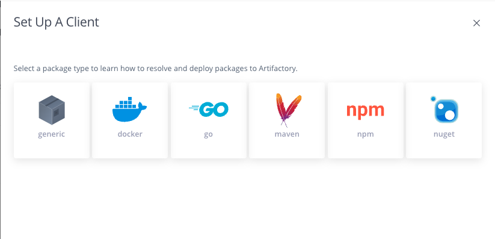

# JFrog Workshop Guide

## 實驗過程
1. 測試 Maven 構建整合 JFrog Platform 的 workflow。
   - 執行 Maven 構建，透過 JFrog Artifactory 進行依賴下載。
   - 將構建產出物上傳到 JFrog Artifactory ，並進行漏洞掃描。
2. 測試透過 JFrog CLI tool 進行 Maven 構建整合。
   - 執行構建，並上傳和收集構建資訊至 JFrog Artifactory。
   - 對構建進行漏洞掃描，並嘗試修復漏洞。
3. 測試 Docker 構建整合 JFrog Platform 的 workflow。
   - 將構建的 Jar 包放入 Docker 映象。
   - 掃描 Docker 映象，配置漏洞掃描策略，阻止超高危漏洞的下載。
        
## 準備
### 本地環境
在您的個人電腦或者構建伺服器上預先安裝好所需工具
-  JDK >= 1.8
-  Maven >= 3.5.3
-  Docker Client >= 20.10.6

## 實驗 1 - Maven build integration


1. 建立您的 Maven 倉庫

   - [Create remote repository](https://jfrog.com/help/r/jfrog-artifactory-documentation/configure-a-remote-repository)
   - [Create local repository](https://jfrog.com/help/r/jfrog-artifactory-documentation/configure-a-local-repository)
   - [Create virtual repository](https://jfrog.com/help/r/jfrog-artifactory-documentation/configure-a-virtual-repository)
2. 之後您可以在 **Artifacs** 欄目瀏覽所上傳的製品。
3. 透過 set me up 功能查看如何使用倉庫

   - [Set Me Up](https://jfrog.com/help/r/jfrog-artifactory-documentation/configure-a-package-manager-client)
## 實驗 2 - JFrog CLI intergration
> 執行第三步Connect your CI tool，選擇 Other CI，之後您將獲取到JFrog CLI 的文件連結。您也可以嘗試其他 CI tools 的整合。
1. 直接下載您作業系統對應的jf二進位制程式，[下載地址](https://releases.jfrog.io/artifactory/jfrog-cli/v2-jf/2.48.0/)。
2. 以 Linux 作業系統為例，直接將該程式授權並加入PATH
```sh
wget https://releases.jfrog.io/artifactory/jfrog-cli/v2-jf/2.48.0/jfrog-cli-linux-amd64/jf
chmod +x jf
mv jf /usr/local/bin/
```
3. 互動式配置 jf 工具連線 JFrog Artifactory:


4. 互動式配置 jf 工具連線 Artifactory Maven 虛擬倉庫:


5. 透過 jf 工具執行 Maven 構建：
```sh
cd my-app
jf mvn clean install --build-name maven-demo --build-number 1.0
jf rt bp maven-demo 1.0 # 此處需要和上面構建時的build對應
```

6. 在 Artifactory 檢視製品和 Build info：


## 實驗 3 - 使用 Xray 掃描 Maven 漏洞並修復
1. 返回 **Get Started** 欄目，之後點選 View scan results 可以檢視指定倉庫內的製品的漏洞資訊
2. 修改示例專案的 POM 檔案，新增以下 dependency ：
```xml
		<dependency>
			<groupId>org.apache.logging.log4j</groupId>
			<artifactId>log4j-core</artifactId>
			<version>2.14.0</version>
		</dependency>
```
3. 繼續修改 POM 檔案，直接替換 build 節點中的內容，將依賴的 jar 一併打包：
```xml
    <build>
        <plugins>
            <plugin>
                <groupId>org.apache.maven.plugins</groupId>
                <artifactId>maven-assembly-plugin</artifactId>
                <version>3.3.0</version>
                <configuration>
                    <archive>
                        <manifest>
                            <mainClass>com.mycompany.app.App</mainClass>
                        </manifest>
                    </archive>
                    <descriptorRefs>
                        <descriptorRef>jar-with-dependencies</descriptorRef>
                    </descriptorRefs>
                </configuration>
                <executions>
                    <execution>
                        <id>make-assembly</id>
                        <phase>package</phase>
                        <goals>
                            <goal>single</goal>
                        </goals>
                    </execution>
                </executions>
            </plugin>
        </plugins>
    </build>
```
4. 將前面上傳的 Build 加入 Xray Index 和 Watch 並儲存。此設定可以讓 Xray 自動掃描我們上傳的構建資訊


5. 透過 jf 工具執行 Maven 構建
```sh
cd my-app
jf mvn clean install --build-name maven-demo --build-number 1.1
jf rt bp maven-demo 1.1 # 此處需要和上面構建時的build對應
```
6. 在 **Artifactory -> Builds** 或**Scan List -> Builds** 檢視掃描結果，找到log4j-core:2.14.0版本的高危漏洞


7. 根據修復提示，將示例專案的 POM 檔案的 log4j-core版本升級為2.16.0
```shell
		<dependency>
			<groupId>org.apache.logging.log4j</groupId>
			<artifactId>log4j-core</artifactId>
			<version>2.16.0</version>
		</dependency>
```
8. 修改構建號，重新執行 JFrog CLI 構建，此時致命漏洞已經修復：


## 實驗 4 - Docker build intergration

1. 在 **Get Started** 欄目點選`Redo`選擇 Docker Package 型別進行倉庫的建立
2. 建立完成後，點選`Continue`，之後選擇`Docker Client`方式進行整合。
3. 跟隨指引程式完成第二步 Docker Package 的拉取和推送。

> 注意，需要跟隨步驟完成後，頁面才可以點選`Next`。

## 實驗 5 - 使用 Xray 阻斷 Docker 映象構建
1. 將示例專案的 POM 檔案的 log4j-core版本降級為2.14.0，並重新打包構建
2. 使用以下 Dockerfile，用來製作帶有漏洞的基礎映象
```Dockerfile
FROM <yourname>.jfrog.io/<prefix>-docker/busybox
COPY target/my-app-1.0-SNAPSHOT-jar-with-dependencies.jar /tmp
```
3. 製作映象，並推送到 Docker 倉庫
```sh
docker build -t <yourname>.jfrog.io/<prefix>-docker/base-image:1.0 .
docker push <yourname>.jfrog.io/<prefix>-docker/base-image:1.0
```
4. 修改全域性策略阻斷致命級別漏洞的製品下載，並儲存


5. 再次嘗試拉取該映象，觀察結果
```sh
docker pull <yourname>.jfrog.io/<prefix>-docker/base-image:1.0
```

